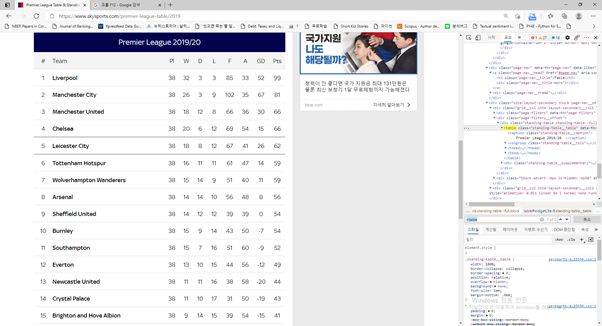
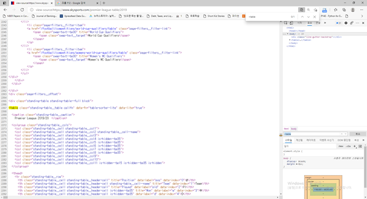
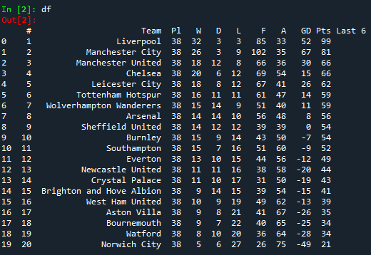

# R-Py 컴퓨팅 Homework1

## Part 1 영국 축구리그 순위 데이터 크롤링

* https://www.skysports.com/premier-league-table/2019 싸이트를 방문하여 본다.
* 여기는 2019-2020년 영국 축구리그인 프리미어리그 20개 팀의 최종성적이 표로 제시되어 있으며 여기서 Pl: 총 게임수 W: 승 D: 무승부, L: 패배 F: 득점 A: 실정 GD:득실차를 나타낸다.
* Part 1과제는 이 20개팀의 최종 성적 테이블을 크롤링하여 데이터 프레임을 만들고 간단한 회귀 분석을 해보는 것이다.

Q1.

A) F12를 사용하여 개발자 도구를 열고 가장 먼저 발견되는 table tag (&#60;table&#62;)를 찾아보고 스크린 샷을 해서 제출하라 (하기 그림 참조 속성값들이 있기 때문에 <table 로 검색하라)

B) 브라우져(크롬/엣지) view-source: https://www.skysports.com/premier-league-table/2019를 하고 ctrl+F (윈도우 기준) 하여 <table을 찾아서 하기와 같이 스크린샷 하라.

C) 이 웹페이지에서 &#60;table&#62; 태그를 가진 html 객체는 하나이다. Q1과 Q2에서 찾은 table tag에 연관된 클래스 속성의 이름은 동일한가 다른가?

Q2. Viewsource 클래스 이름을 기준으로 테이블을 웹크롤링하여 데이터 프레임을 만든다.

* 테이블을 웹크롤링하는 방법은 실시간 강의를 대체한 온라인 강의 6주차에 비교적 상세히 설명되어 있으니 참고한다 (아래 스크린샷 참조). 
* STEP1) 먼저 웹페이지를 urllib나 requests library를 사용하여 열어서 객체로 만든다. 
* STEP2) BeautifulSoup을 사용하여 이파일을 읽고 soup이라는 객체를 만든다.
* STEP3) 이 soup객체에 find (soup.find) 메소드를 적용하여 tag 이름은 ”table”이고 class속성은 ” standing-table__table callfn”을 찾아 table 객체로 저장한다.
* STEP4) headers란 리스트를 만들어서 이 table객체에서 th 태그를 가진 것들의 내용들을 다 모은다. 즉 Pl, W, D, L, …. GD등 여러분이 본 최종순위 테이블의 헤더들을 다 수집한다. 
* STEP5) df = pd.DataFrame(columns = headers)를 적용하여 데이터 프레임을 만든다. 
* STEP6) 이 df 에 대해 상위 순위부터 하위순위까지 순서로 데이터 내용을 저장한다.하기 켑쳐본의 코드를 활용하되 strip함수를 사용하여 /n 등 공백 문자열들을 제거한다. 

결과 아마 다음과 같은 데이터 프레임을 얻을 수 있다.

Q3. 승률과 골득실차와의 관계를 회귀 분석을 통해 분석해보고자 한다.

* STEP1) df에 승률(win_prob)를 승리회수(W)을 전체 게임수(PL)로 나눈 것으로 정의한다. 예를 들어 리버플의 승률=32/38이다. 데이터 프레임의 모든 칼럼이 문자열 형으로 지정되었을 수 있음으로 astype을 활용하여 필요 칼럼을 실수형으로 변환한다. (as type에 관해서는 https://hogni.tistory.com/70 참고) 
* STEP2) 다음과 같은 library를 import해서 선형회귀 분석을 준비한다. 
from sklearn.linear_model import LinearRegression
import numpy as np
* *STEP3) X=df["GD"], Y=df[“win_prob”]하여 Y=a+bX라는 회귀분석을 수행해 보고 a값고 b값을 출력해 본다. 골득실과 승리확률은 어떠한 관계가 있는가 자신의 의견을 기술해보라.

Q4. 선형회귀 분석의 결과에 대해 p-값과 같은 다양한 통계량을 출력해보고자 한다. 내용을 모른다면 다음 명령어만 수행해보아도 상관없다.

<pre><code>
import statsmodels.api as sm
X2 = sm.add_constant(X)
est = sm.OLS(Y, X2)
est2 = est.fit()
print(est2.summary())
</code></pre>

Q3과 Q4의 절편과 기울기 결과값들은 동일한가?

## Part 2 보스턴 주택가격 데이터 분석하기: boston_csv.csv 파일

* 보스턴 주택 가격 데이터의 변수명은 다음과 같다.

  * CRIM : 자치시(town) 별 1인당 범죄율
  * ZN : 25,000 평방피트를 초과하는 거주지역의 비율
  * INDUS : 비소매상업지역이 점유하고 있는 토지의 비율
  * CHAS : 찰스강에 대한 더미변수 (강의 경계에 위치한 경우는 1, 아니면 0)
  * NOX : 10ppm 당 농축 일산화질소
  * RM : 주택 1가구당 평균 방의 개수
  * AGE : 1940년 이전에 건축된 소유주택의 비율
  * DIS : 5개의 보스턴 직업센터까지의 접근성 지수
  * RAD : 방사형 도로까지의 접근성 지수
  * TAX : 10,000 달러 당 재산세율
  * PTRATIO : 자치시(town)별 학생/교사 비율
  * B : 1000(Bk-0.63)^2, 여기서 Bk는 자치시별 흑인의 비율을 말함. 
  * LSTAT : 모집단의 하위계층의 비율(%)
  * MEDV : 본인 소유의 주택가격(중앙값) (단위: $1,000)
  * CAT.MEDV : MEDV 가 $30,000 을 넘는지에 대한 변수 (넘는 경우 1, 아닌 경우 0)
* 보스턴 주택 가격 데이터에서 결측치는 na와 NaN으로 표시되어 있다.
* 다음과 같은 라이브러리를 불러와야 프로그램이 구현될 것이다.
<pre><code>
from sklearn.linear_model import LinearRegression 
from  sklearn.metrics import mean_squared_error
import numpy as np
import matplotlib.pyplot as plt 
import pandas as pd  
import seaborn as sns
</code></pre>

Q5. 다음과 같은 전처리를 시행하라
1. 제공된 boston_csv.csv 파일을 사용하여 pandas 데이터 프레임 객체를 만든다, 결측치 코드인 na와 NaN이 모두 실제 결측치로 되도록 한다.
2. 이와 같은 결측치가 있는 관측치를 모두 제거한다.

Q6. 다음과 같은 요약 통계를 구하라
1. describe 메소드를 적용해서 각 변수별 요약 통계를 구한다.
2. 상관관계를 구한후 seaborn 라이브러리의 heatmap을 구현한다.

Q7. 다음과 같은 단순회귀분석 모형을 Training Set과 Test Set을 통해 구현하라.
* 모집단의 하위계층의 비율(LSTAT)이 독립변수
* 본인 소유의 주택가격(중앙값)인 MEDV가 종속변수 
* Training set이 표본의 75%를 차지한다.
* Training Set에대해서는 회귀 분석 추정 계수 및 R2 값 mean squared error 값을 보고한다.
* Training Set에대해서는 회귀 분석 추정 계수 값을 바탕으로 Test Set에서 예측한 후 mean squared error 값을 보고한다.

Q8. 다음과 같은 다중회귀분석 모형을 Training Set과 Test Set을 통해 구현하라.
* 모집단의 하위계층의 비율(LSTAT)과 10,000 달러 당 재산세율(TAX)가  독립변수
* 본인 소유의 주택가격(중앙값)인 MEDV가 종속변수 
* Training set이 표본의 75%를 차지한다.
* Training Set에대해서는 회귀 분석 추정 계수 및 R2 값 mean squared error 값을 보고한다.
* Training Set에대해서는 회귀 분석 추정 계수 값을 바탕으로 Test Set에서 예측한 후 mean squared error 값을 보고한다.
