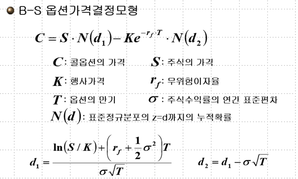
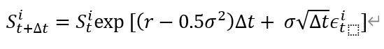
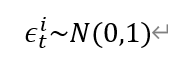
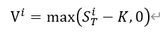
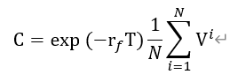

# R-Py 컴퓨팅 Homework2

## Part1. 와인 클래스에 대한 knn 알고리즘 적용
와인 데이터 구성

The data is the results of a chemical analysis of wines grown in the same region in Italy by three different cultivators. There are thirteen different measurements taken for different constituents found in the three types of wine.

이 와인의 화학적 분석 결과는 다음과 같이 정리된다. 

Attribute Information:
* Alcohol
* Malic acid
* Ash
* Alcalinity of ash  
* Magnesium
* Total phenols
* Flavanoids
* Nonflavanoid phenols
* Proanthocyanins
* Color intensity
* Hue
* OD280/OD315 of diluted wines
* Proline

와인 종류는 class 변수로 구분되어 있으며, 1, 2, 3을 각 코드값으로 지니고 있다.

이 와인데이터 (wine_data.csv) 파일에 대해서 다음과 같은 분석을 행하라.

1. Pandas를 사용해 wine_data.csv파일을 wine 데이터프레임을 만든다.
2. Wine 데이터에 describe 메소드를 사용하여 요약통계량을 구한다.
3. 주어진 데이터에 첫 변수, class를 우리가 예측하는 타겟 변수, y, 나머지 모든 변수를 예측 변수 X로 활용하고, Train/Test 표본을 70% 와 30%가 되도록 데이터를 구성한다. 각각의 명칭은 X_train/X_test, y_train/y_test로 칭한다. 
4. Scikit-learn의 KNeighborsClassifier를 사용하여 70%인 X_train과 y_train을 바탕으로 모형을 트레이닝 시킨다.  
5. 이 Training 된 모형을 바탕으로 Training Set에서 예측해보고 원래의 라벨을 얼마나 정확하게 예측하는지 percentage 단위로 출력하고, k=5로 결정하고 다수결 및 유클리디안 거리를 사용한다. .  
6. 이 Training 된 모형을 바탕으로 Test Set에서 원래의 라벨을 얼마나 정확하게 예측하는지 percentage 단위로 출력한다. . 
7. 5-6번을 k=3일 경우에 대해서도 시행한다. 
8. 3-6번에서 X 데이터를 Alchol, Malic acid, Ash, Alcalinity of ash 네 변수만 활용하여 다시 수행한다.

## Part2. 콜옵션 가격 시계열 시뮬레이션 (R 프로그래밍)

<pre><code>
콜옵션은 ‘살 수 있는 권리’라는 뜻입니다. 좀 유식하게 표현하면 매입선택권이죠. 예를들어 설명해드리겠습니다. 햇빛 내리는 따스한 봄날에 나들이를 하던 농산물 수집상은 걱정거리가 하나 있었습니다. 올해 가을에 배추 값이 폭등할 것 같았기 때문이죠. 한 포기에 최소한 만원은 할 것 같습니다. 이때 농산물수집상은 농부아저씨와 이렇게 계약을 합니다.
“농부아저씨! 올해 가을에 배추 한포기에 2000원씩, 총 1만 포기를 사고 싶어요. 하지만 조건이 있어요. 제는 사기 싫으면 안사도 되는 걸로 해요. 제 마음대로 하는 대신에 특별히 보너스 200만원을 드릴께요”
배추 값이 폭등해 한포기당 1만원이 되면 어떤일이 일어날까요? 콜옵션, 쉽게말해 ‘살 수 있는 권리’를 행사하면 됩니다. 배추 한포기에 2000원에 살 수 있는 권리를 행사해 1만 포기를 사면 됩니다. 물론 배추 값이 폭락하면 특별보너스 200만원을 깨끗이 포기하면 됩니다.
풋옵션은 ‘팔 수 있는 권리’라는 뜻입니다. 좀 그럴듯하게 표현하면 매도선택권이죠. 예를들어 여러분이 농부 아저씨라고 가정해 봅시다. 봄에 농사를 시작하면서 이만저만 걱정이 아닙니다. 열심히 농사를 지었는데 가을에 배추값이 폭락하면 큰일이기 떄문입니다. 그동안의 경험으로 볼 때 올해는 틀립없이 한포기당 10원까지 갈것같은 예감이 듭니다. 이때 농부아저씨는 농산물 수입상과 이렇게 계약을 합니다.
“농산물 수집상님! 올해 가을에 배추 한포기에 2000원, 총 1만포기를 팔고 싶어요. 하지만 조건이 있어요. 제는 팔기 싫으면 안 팔아도 되는 걸로 해요. 제 마음대로 하는 대신에 특별보너스로 200만원을 드릴께요”
시간이 흘러 낙엽지는 가을이 찾아왔고, 농부아저씨의 예상대로 배추값이 폭락해 한포기당 10원이 되었다고 합시다. 어떤일이 일어날까요? 농부아저씨는 풋옵션, 즉 ‘팔 수 있는 권리’를 행사하면 됩니다. 다른 농부아저씨들이 차마 10원에 배추를 팔 수 없어 밭을 갈아 엎을때! 1포기에 2000원씩, 총 1만포기를 팔아 돈을 벌면 됩니다.
만약 배추가격이 폭등해 한포기당 만원이 되었다면 어떻게 할까요? 그냥 계약을 파기하고, 시장에서 한포기당 만원을 받고 팔면 됩니다. 농부 아저씨에게는 농산물 수집상한테 ‘팔고 싶으면 팔고, 팔기 싫으면 안 팔아도 되는 권리’가 있기 때문입니다.
</code></pre>

보다 구체적으로 콜옵션은 기준자산(underlying asset)을 만기일(maturity date/expiration date)에 행사가격(strike price/exercise price)을 주고 살 수 있는 권리라고 정의할 수 있다. 예를 들어 (기준자산, 만기일, 행사가격)이 (A 주식, 7월 12일, 50,000원)으로 정해진 콜옵션을 매입한 사람은 7월 12일에 A 주식을, 그 날의 실제 주가가 얼마이든지 50,000원에 살 수 있는 권리를 가진 것이다. 예를 들어 7월 12일 A 주식의 가격이 65,000원이 된다면, 이 콜옵션을 보유한 투자자는 65,000원의 가치를 갖는 주식을 50,000원에 살 수 있으므로 65,000원과 50,000원의 차액인 15,000원의 수입으로 얻게 된다. 한편, 7월 12일에 A 주식의 가격이 45,000원이 된다면, 45,000원의 가치를 갖는 주식을 50,000원에 살 수 있는 권리는 아무런 가치도 갖지 않게 된다. 왜냐하면 내가가진 옵션을 행사해서 50,000에 사는 것보다 주식시장에서 사는 것이 훨씬 더 저렴하기 때문이다.

다시 말해서 콜옵션 매입자는 만기 기준자산의 가격이 행사가격보다 크면 그 차액을 수입으로 얻지만, 행사가격보다 작으면 아무런 수입도 얻지 못하게 된다. 콜 매입자가 만기에 기준자산을 행사가격에 사겠다고 요구하는 것을 콜옵션을 행사한다(exercise)고 표현한다. 콜의 매입자는 만기의 기준자산 가격이 행사가격을 초과할 경우만 그 옵션을 행사할 것이다.

옵션은 하나의 권리이기 때문에, 상응하는 의무를 지게 되는 거래의 상대방이 존재해야 한다. 콜옵션을 소유한 사람이 요구할 경우, 만기일에 기준자산을 행사가격에 매입하는 의무를 지겠다고 약속하는 것을 콜옵션을 발행한다고 표현한다. 콜옵션을 발행하려는 사람이, 그러한 의무를 지겠다는 약속에 대해서, 콜옵션을 매입하려는 사람에게 요구하는 대가를 옵션 프리미엄(option premium)이라고 하며 일종의 옵션의 가격으로 해석이 된다. 옵션을 매입하는 사람은 이러한 가격을 지급하고 만기에 기준자산의 가격에 따라서 플러스 또는 0의 수입을 얻는 것이다.1

수식으로 표현하여 행사가격을 K, 만기일의 기준자산가격을 ST라고 표시할 때, 콜의 소유자는 Max(ST-K, 0)의 수입을 얻게 된다. Max(X, Y)란 X와 Y의 두 값 가운데 큰 값을 의미한다.

정리하자면, 오늘 콜옵션의 가격을 C로 표현할 때 콜의 소유자와 발행자 각각의 거래일의 현금흐름과 만기에서의 수입은 다음과 같다. 즉

콜옵션 소유자

* 오늘의 현금흐름2 = -C
* 만기의 수입 = max(ST-K, 0)

콜옵션 발행자

* 오늘의 현금흐름 = +C
* 만기의 수입 = -max(ST-K, 0) 또는 min(K-ST, 0)

다음을 R 코드로 작성하고 실행 결과를 보고하라.

1 용어를 정리하면, 옵션의 매입자(option buyer/holder)는 옵션에 대해서 사자(long) 포지션을, 옵션의 발행자(option writer/seller)는 팔자(short) 포지션을 취하였다고 표현한다.

2 오늘 옵션 거래가 일어났다고 생각한다.

Q1. 만기에서의 콜옵션 소유자의 수입 Y를 기준자산, 여기서는 주식 ST의 가격의 그래프로 나타내라. ST의 범위는 0부터 200까지이며 K=100으로 고정한다.

Q2. 노벨상을 수상한 블랙-숄즈-머턴은 이와 같은 콜옵션의 프리미엄 C가 특정가정들을 만족한 경우 다음과 같은 식에 의해서 결정되어야 한다고 증명하였다.

여기서 S는 오늘의 주식 가겨글 의미하고 e는 자연대수를 의미한다. 따라서 오늘의 콜옵션가격은 오늘의 주가(S), 만기(T), 행사가격(K), 주식의 변동성 σ, 무위험 이자율 rf에 의해 결정된다. 이 다섯가지 요소를 함수의 인자로 받고, 콜옵션 가격을 계산해주는 BSM 함수를 R로 코딩한 후, S=100, K=100, T=0.5, σ=0.1, rf=0.04에 대해 결과값을 계산해라.

Q3. 재무 이론의 발전은 블랙숄즈머턴의 방법론과 동일한 결과를 다음과 같이 옵션 만기 T시점까지 주가의 경로를 N번 시뮬레이션을 함으로써 얻을 수 있음을 확인하였다. 여기서 i는 i번째 주가의 path를 의미하고 t는 0부터 만기 T까지의 시간 경로를 의미한다. 주가의 경로를 0, 0+Δt, 0+2Δt,….. 0+MΔt, Δt=T/M 시점에 대해서 각각 산출한다는 의미이다. 이와 같은 시점별 주가 Sit 즉 t시점 주가에서 Sit+Δt로 t+Δt시점으로의 주가 경로식은 아래와 같이 주어진다.

이러한 i번째 주가 경로에 대해서 만기시점의 옵션의 가치 Vi는

과 같이 정리될 수 있다. 옵션의 가치 C는

로 계산된다. Δt=1/1000, N=10000번으로 하여 Q2와 동일한 상황에서 옵션 가격을 계산한다 즉 (500+1)개의 관측치를 가진 주가의 예상 경로를 10000번 생성하여 T기에서 주식가격 10000개 생성하고 그에 따르는 옵션가격을 결정한다. 또한 10000개중 다섯개의 주가 경로에 대해 오늘부터 만기까지(0->T) 꺽은선 형태의 그래프로 표기한다. 여기서 X축은 0, 0+Δt, 0+2Δt,….. 0+MΔt, Δt=T/M이고 대응되는 Y값은 각 시점의 경로별 주가이다.